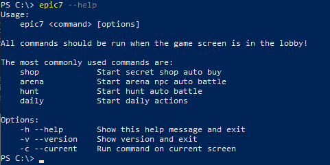

# Getting Started with Epic7 Bot

An introductory tutorial!

---

## Requirements

- [Chocolatey](https://chocolatey.org/)
- [Android Debug Bridge](https://community.chocolatey.org/packages/adb)
- [Python 3.4+](https://www.python.org/downloads/release/python-392/)

## Installation

To install Epic7 Bot, run the following command from the command line:

```bash
pip install epic7-bot
```

For more details, see the [Installation Guide].

## Using the CLI

To see the commands, run the following command from the command line:

```bash
epic7 --help
```

Take a moment to review all the commands available.



## Getting help

See the [User Guide] for more complete documentation of all of Epic7 Bot' features.

To get help with Epic7 Bot, please use the [GitHub discussions] or [GitHub issues].

[Installation Guide]: user-guide/installation.md
[GitHub discussions]: https://github.com/brunocordioli072/epic7_bot/discussions
[GitHub issues]: https://github.com/brunocordioli072/epic7_bot/issues
[User Guide]: user-guide/README.md
