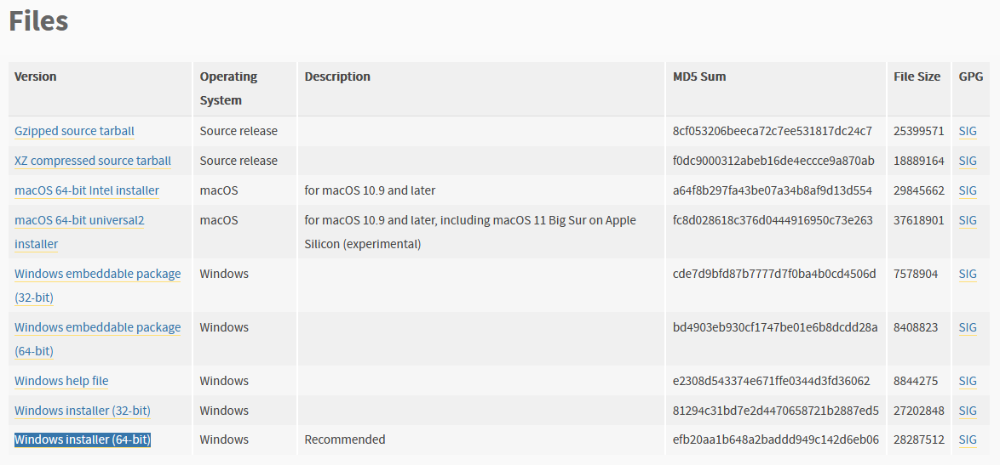

# Installation

A detailed guide.

---

## Requirements

- [Python 3.4+]
- [Chocolatey]
- [Android Debug Bridge]
- [Git]


## Install Python

Visit [Python install page](https://www.python.org/downloads/release/python-392/).

Install the windows installer one.




## Installing Chocolatey
[Chocolatey] is a package manager for windows. It is easier to install all the requirements by using it.

Visit [Chocolatey install page].

## Installing Android Debug Bridge
[Android Debug Bridge] is command-line tool that enable communication with a device. The bot uses it to
sent click inputs to the screen.

Install via [Chocolatey].

```console
$ choco install adb
```

## Installing Git
[Git] is a distributed version control system. It's used to enable installation direcly via repo.

```console
$ choco install git
```

## Install Epic7 Bot
To install Epic7 Bot, run the following command from the command line:

```bash
pip install git+https://github.com/brunocordioli072/epic7_bot
```


[Chocolatey]: https://chocolatey.org/
[Chocolatey install page]: https://chocolatey.org/install
[Android Debug Bridge]: https://community.chocolatey.org/packages/adb
[Python 3.4+]: https://www.python.org/downloads/release/python-392/
[Git]: https://community.chocolatey.org/packages/git